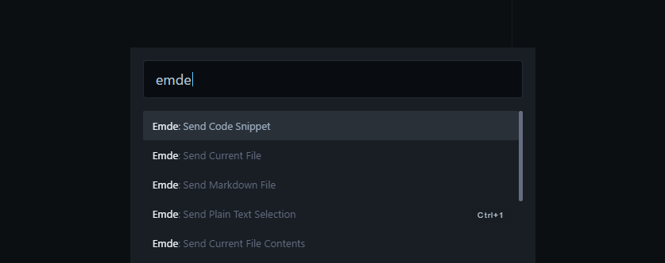
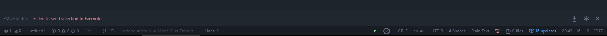
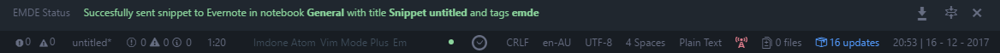
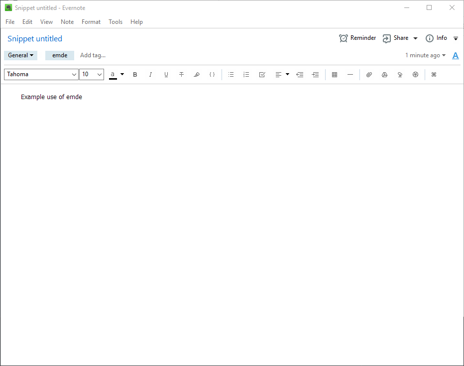

# evernote-markdown-editor (emde)
The aim of this package was to enable the creating of Evernote notes in Atom using markdown. It was original created as a proof of concept and to fix a specific problem that had otherwise not been solved, specifically for Windows. 

The original aim was to achieve this completely offline and without use of the Evernote API. 

It only supports Windows at this time.

Inspiration is [ever-notedown](https://atom.io/packages/ever-notedown)

It makes use of Evernote [ENScript](https://dev.evernote.com/doc/articles/enscript.php) command line functions.

This project is not by any means complete and has been abandoned in favour of existing options available in other editors such as [VS Code](https://marketplace.visualstudio.com/items?itemName=rhapsodyn.vscode-evernote). As such you will find numerous TODOs throughout the code that represent the original planned changes. These are not the only method of achieving these ends but were purely the direction I had originally planned to take it.

I have made this repository available for anyone who is interested in creating an Evernote plugin for Atom or has any use for the features currently implemented.

Feel free to use this code in anyway you like.

## General Naming
+ Tags: default [**emde**].
+ Notebook: default **General**
+ Code snippet and markdown notes having the additional tag of [**md**] for markdown, and the file extension for the code type (taken from the filename) i.e. for a JS snippet the additional

## Commands
Command | Comments
:---:|:---
emde: Send Plain Text Selection | Send the current selected text to Evernote with the selection as the body of the note. The selection is treated as **plaintext** <ul><li>**Title** is the title of the file.</li></ul>
emde: Send Code Snippet | Similar to _Send selection to Evernote_ with the addition of the text being formated as a code block. An attempt is made to match syntax highlighting to the code langauge.
emde: Send Current File Contents | Send the contents of the current file to Evernote as **plain text**.
emde: Send Current File| Create a new Evernote note with the current file attached.
emde: Send Markdown File | Similar to _Send Current File to Evernote_ with the exception of the contents being treated as markdown and rendered before being added to Evernote.

## How to Use
To use this within your Atom editor do the following,
1. Clone this repository into your Atom packaged directory. i.e. ``~/.atom/packages/``, the location of this may vary depending on how you installed Atom, what operating system you are using etc.
2. Restart Atom and set the location of of your ``Evernote.exe`` and ``ENScript.exe`` files in the settings of the ``evernote-markdown-editor`` package.
3. From the Atom command pallette (ctrl-shift-p) all emde commands are pre-pended with ``emde``.
    
4. The status of each command is displayed at the bottom of the screen.
    
    

## Implemented Commands
The following commands have been implemented and can be used.
+ Send Plain Text Snippet
    
+ Send Current File

## Classes
### Evernote
Found in ``evernote.coffee`` provides an interface for interacting with Evernote. It achieves this by providing wrapper methods for the required CLI calls.

## emde
The main class for the plugin. Found in ``emde.coffee``.

This provides the settings and registers and controls the commands.

## Enex
Found in ``enex.coffee``. A class for providing the two-stage transformation required to import formatted notes into Evernote
i.e. markdown->HTML->Enex.

Currently not implemented.

## Note
Found in ``note.coffee``. It provides a data structure for a 'note'. This note structure is used throughout the application.

A note has the following attributes,
+ title - The title of the note
+ content - The content, the body text
+ tags - A list of tags
+ notebook - The notebook it belongs to
+ date - The creation date
+ filepath - The filepath to the file associated with it (used for attaching current file and the ENEX two-stage transformation)

## Todo
- [ ] Implement "Send Code Snippet"
- [ ] Implement "Send Current File Contents"
- [ ] Implement "Send Markdown File Contents"
